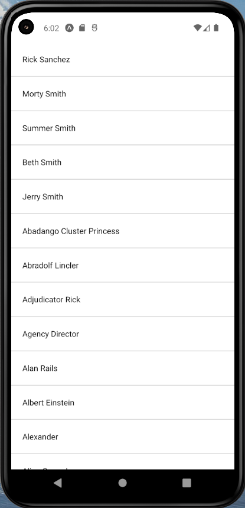

# Reto Rimac Mobile



## Descripción
Este proyecto esta desarrollado con React Native y Expo principalmente, muestra un lista de elementos con scroll infinito desde una api.

## Requisitos
- Node.js 20+
- Visual Studio Code
- Android Studio

## Instalar dependencias
`npm install`

## Iniciar proyecto
`npm start`


## Iniciar en Android
`npm run android`

## Iniciar en iOS
`npm run ios`

## Reto
*Revisa el código a continuación e identifica los varios posibles problemas que podrían llevar a fallas, bloqueos o comportamientos ineficientes. Propone optimizaciones o correcciones donde sea necesario.*

Se ha identificado los siguientes problemas y soluciones:
- Importaciones innecesarias que causan que la aplicación no inicie.
```javascript
// Se comenta la importación de console ya que no es necesaria
// import console from 'console';
```
- Actualizar la version de **"@expo/vector-icons"** ya que puede no ser compatible con la version del SDK de expo(51),
```javascript
// 14.0.2 => 14.0.3
"@expo/vector-icons": "^14.0.3"
```
- Faltaba añadir await al response y se optimizón la función **fetchItems()**.
```javascript
// se agrega useCallback para evitar que se cree una nueva función cada vez que se renderiza el componente
    const fetchItems = useCallback(async () => {
        console.log('fetch data =====', page)
        try {
            const response = await fetch(
                `https://rickandmortyapi.com/api/character?page=${page}`
            )
            // Se agrega await a la respuesta para esperar a que se resuelva la promesa
            // const data = response.json();
            const data = await response.json()

            /**
             * Se cambia setItems(data.results) por setItems((state) => [...state, ...data.results])
             * para que se agreguen los nuevos elementos a los ya existentes
             */
            // setItems(data.results);
            setItems((state) => [...state, ...data.results])
        } catch (error) {
            console.error('Error al obtener los elementos:', error)
        } finally {
            setLoading(false)
        }
    }, [page])
```
- Se modificó el **useEffect** para evitar renderizados innecesarios.
```javascript
useEffect(() => {
        fetchItems()

        // Se cambia [items] por [page] para que se ejecute fetchItems cada vez que cambie la página
    }, [fetchItems, page])
```
- Se optimizó la función **renderItem**.
```javascript
/**
     * Se cambia renderItem para que renderice un solo item
     * Se agrega useCallback para evitar que se cree una nueva función cada vez que se renderiza el componente
     */
    const renderItem = useCallback(({ item }) => {
        return (
            <View
                key={item.id}
                style={styles.item}
            >
                <Text>
                    {item.name}
                </Text>
            </View>
        )
    }, [])
```
- Se optimizó la lista de items, agregando SafeAreaView para que sea vea bien en todos los dispositivos y se agregó al componente **FlatList** la propiedad *initialNumToRender* y se separó el componente **ListFooter** y los estilos.
```javascript
/**
     * Se agrega SafeAreaView para evitar que el contenido se superponga
     * en algunos dispositivos con notch o barra de estado
     */
    return (
        <SafeAreaView
            style={styles.container}
        >
            <FlatList
                data={items}
                renderItem={renderItem}
                keyExtractor={(item) => item.id}
                initialNumToRender={15} // Se agrega initialNumToRender para renderizar los primeros 15 elementos
                onEndReached={handleLoadMore}
                onEndReachedThreshold={0.5}
                ListFooterComponent={<ListFooter page={page} />}
            />
        </SafeAreaView>
    )
```
- Se separaron los estilos
```javascript
// Se separan los estilos en un objeto para mejorar la legibilidad del código
const styles = StyleSheet.create({
    container: {
        flex: 1,
        /**
         * Se agrega paddingTop para evitar que el contenido se superponga
         * ya que SafeAreaView no funciona en Android
         */
        paddingTop: Platform.OS === 'android' ? StatusBar.currentHeight : 0,
    },
    item: {
        padding: 20,
        borderBottomWidth: 1,
        borderBottomColor: '#ccc',
    },
    loader: {
        flex: 1,
        justifyContent: 'center',
        alignItems: 'center',
    },
});
```
- Se separaron los componentes **ListFooter** y **Loader**.
```javascript
// Se separan los componentes Loader y ListFooter para mejorar la legibilidad del código
export const Loader = () => {
    return (
        <View
            style={styles.loader}
        >
            <ActivityIndicator size="large" color="#0000ff" />
        </View>
    )
}

export const ListFooter = ({ page }) => {
    if (page >= PAGE_LIMIT) return null
    return <Button title="Cargar Más" />
}

```
